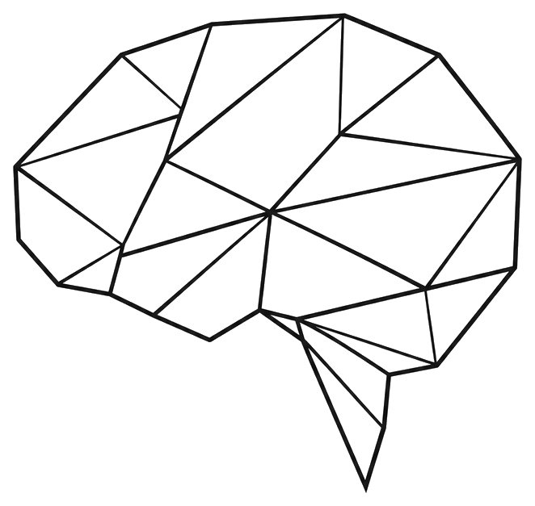

# Polygon Brain Lab

<p align="center">
  
</p>

<p align="center"><strong>Hackers del cerebro. Con método.</strong></p>

<p align="center">
  Laboratorio abierto de herramientas cognitivas, recursos prácticos y experimentación neurotecnológica.
</p>

<p align="center">
  <a href="https://github.com/polygonbrainlab/polygon-brain-lab-site"></a>
  
  
  
  
</p>

---

## Qué es

**Polygon Brain Lab** es un laboratorio digital abierto para diseñar, probar y compartir:

- herramientas cognitivas
- recursos prácticos
- prototipos neurotecnológicos
- documentación clara
- pensamiento crítico sobre cognición y tecnología

No es una clínica.
No es una startup de IA clónica.
No vende milagros.

**Construye herramientas. Documenta límites. Explora con método.**

---

## Qué hay ahora en este repo

Este repositorio contiene la **landing v1** de Polygon Brain Lab:

- identidad visual inicial
- home en Next.js
- estilo markdown premium
- sistema blanco/negro con acento azul petróleo
- copy base de marca
- estructura preparada para crecer hacia tools, resources y open lab

---

## Stack

- **Next.js 16**
- **TypeScript**
- **Tailwind CSS v4**
- **Inter + JetBrains Mono**

Sin backend. Sin base de datos. Sin login. Sin datos personales.
Preparado para desplegar en **Vercel**.

---

## Filosofía del proyecto

> Estimulación no es rehabilitación. Tecnología no es evidencia.

Polygon Brain Lab parte de una idea simple:

- abrir lo que merece ser usado
- documentar lo que hacemos
- evitar el neurohumo
- diseñar herramientas con criterio
- construir una capa open-source y otra profesional

---

## Estructura

```txt
polygon-brain-lab-site/
├── app/
│   ├── globals.css
│   ├── layout.tsx
│   └── page.tsx
├── components/
│   ├── Navbar.tsx
│   ├── Hero.tsx
│   ├── Positioning.tsx
│   ├── Manifesto.tsx
│   ├── ValueBlocks.tsx
│   ├── SectionGrid.tsx
│   ├── OpenLab.tsx
│   ├── NeuroCritique.tsx
│   ├── EthicalNotice.tsx
│   ├── CTA.tsx
│   └── Footer.tsx
├── public/
│   └── polygon-brain-logo-premium.png
└── README.md
```

---

## Ejecutar en local

```bash
npm install
npm run dev
```

Luego abre:

```txt
http://localhost:3000
```

---

## Build

```bash
npm run build
```

---

## Despliegue en Vercel

### Opción recomendada
1. Importar el repo en Vercel
2. Detectar automáticamente Next.js
3. Deploy

### Opción por CLI
```bash
npm i -g vercel
vercel
vercel --prod
```

---

## Dirección visual

La web sigue esta fórmula:

**markdown lab + polygon minimal + black/white system**

Principios:
- minimalismo con densidad informativa
- geometría sutil
- tecnología sobria
- documentación antes que decoración
- color solo cuando importa

---

## Próximos pasos

- [ ] subirla a Vercel
- [ ] enlazar GitHub real en todos los CTAs
- [ ] crear primera tool funcional
- [ ] añadir recursos descargables
- [ ] abrir roadmap público
- [ ] añadir artículos de Neuro Critique

---

## Aviso ético

Herramienta experimental y educativa.
No sustituye evaluación, diagnóstico ni intervención profesional.

---

## Frases núcleo

- **Hackers del cerebro. Con método.**
- **No somos una clínica. No somos una startup de IA. Somos un laboratorio.**
- **No vendemos milagros. Construimos herramientas.**

---

<p align="center">
  Polygon Brain Lab · open-source con criterio
</p>
